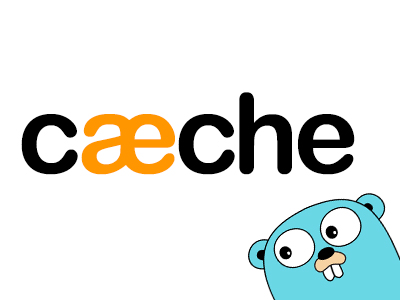
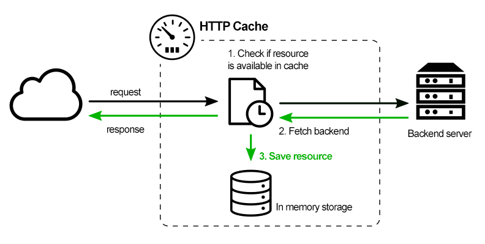
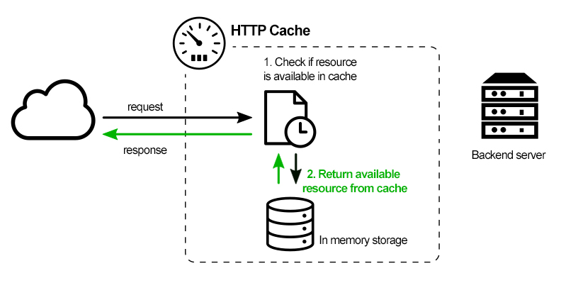

# Caeche

<p align="center">

</p>

Simple Reverse Proxy with caching features, written in Go.  
>>> **(NOT) production-ready** <<<

## How it works

When the request is not cached:
<p align="center">

</p>

When the request is cached:
<p align="center">

</p>

## Features

- **Full Page Caching**, in memory.
- **Cache Invalidation**, by calling HTTP Method `PURGE` on the resource URI.
- **Selective HTTP Status Codes/Methods**, allows caching for different response codes or HTTP methods.
- **Serving Stale Content**, used mainly for avoiding errors when the backend is unreachable.
- **GRPC ready**, supporting HTTP/2 and trailers

## Configuration

### config.toml

This is a simple configuration example:

```toml
# Listening port
port="8080"

# Default TTL
defaultTTL=3600

# Backend to proxify
[backend]
host="localhost:443"
scheme="https"
```